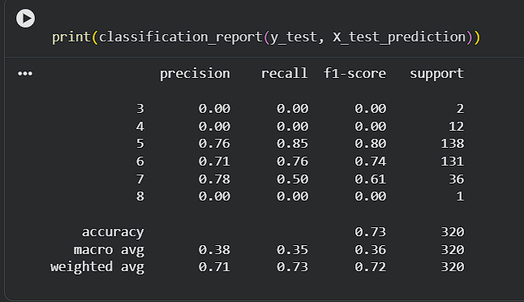
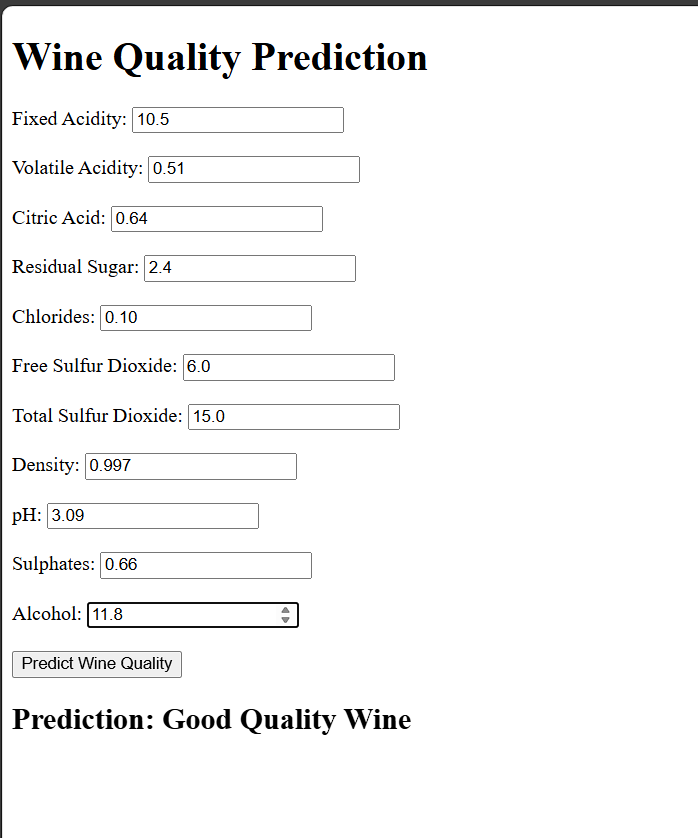
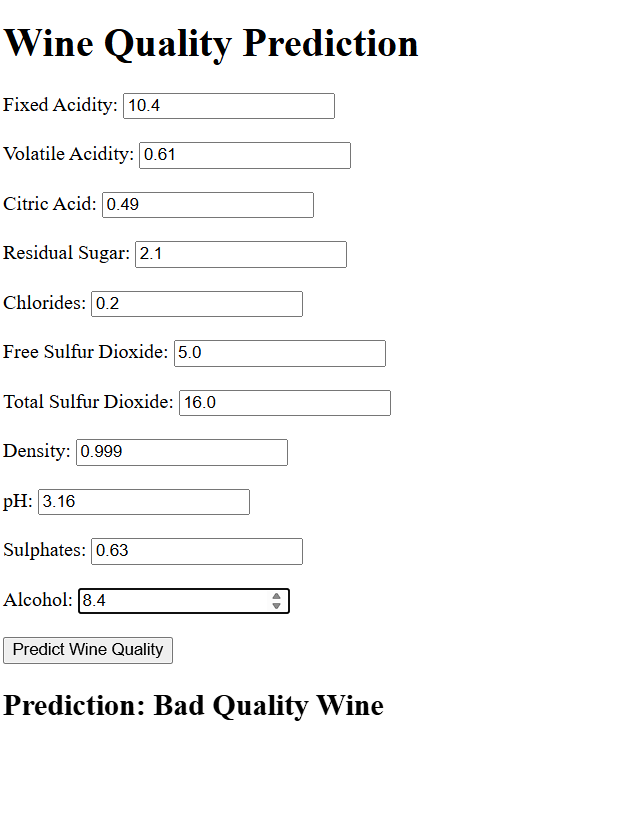

# 🍷 Wine Quality Prediction Project

## 📌 Overview

This project predicts the quality of wine based on its physicochemical properties using a **Machine Learning model (Random Forest Classifier)**. A **Flask web application** is used to take user inputs and display predictions as **Good Quality Wine** or **Bad Quality Wine**.

---

## 🧠 Machine Learning Model

* **Algorithm:** Random Forest Classifier
* **Dataset:** Wine Quality Dataset
* **Target Variable:** Wine Quality Score
* **Approach:**

  * Data preprocessing
  * Train-test split
  * Model training
  * Evaluation using classification metrics

---

## 📊 Model Performance

✔ Best performance observed for wine quality **5 and 6**.

## 🌐 Web Application (Flask)

The Flask app allows users to enter wine parameters via a form and get instant predictions.

### 🔢 Input Features

* Fixed Acidity
* Volatile Acidity
* Citric Acid
* Residual Sugar
* Chlorides
* Free Sulfur Dioxide
* Total Sulfur Dioxide
* Density
* pH
* Sulphates
* Alcohol

 🖥️ User Interface Output

### Example 1:

**Prediction:** ✅ Good Quality Wine

### Example 2:

**Prediction:** ❌ Bad Quality Wine

## ⚙️ Technologies Used

* Python
* Flask
* Scikit-learn
* HTML
* Git & GitHub

## 📁 Project Structure

Wine-Quality-Prediction/

│── app.py

│── model.pkl

│── templates/

│   └── index.html

│── static/

│── requirements.txt

│── README.md

## 🚀 How to Run the Project

git clone https://github.com/Sourabh123-sys/Wine-Quality-Prediction.git

cd Wine-Quality-Prediction

pip install -r requirements.txt

python app.py

Open browser: **[http://127.0.0.1:5000](http://127.0.0.1:5000)**

## ✅ Final Outcome

✔ Successfully built an end-to-end **Machine Learning + Flask Web App**

✔ Model predicts wine quality effectively

✔ User-friendly interface for real-time predictions

## 👨‍💻 Author

**Sourabh Karmakar**

⭐ If you like this project, give it a star on GitHub!
